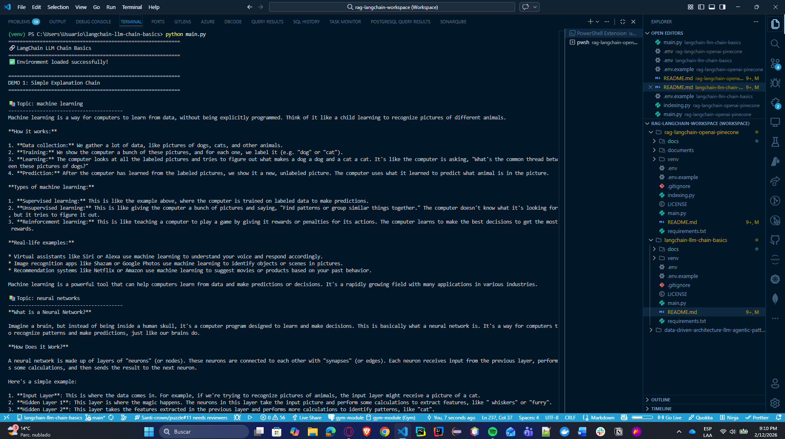
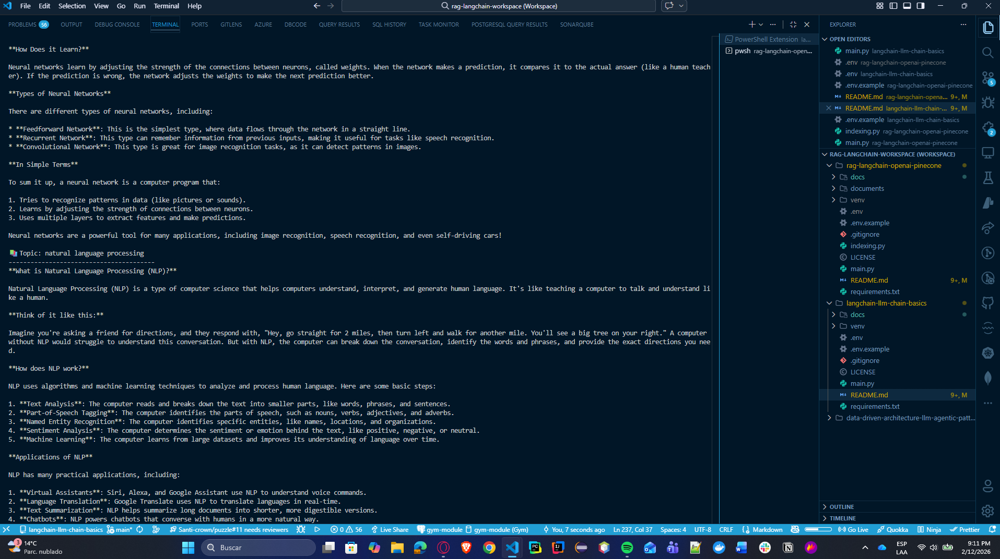
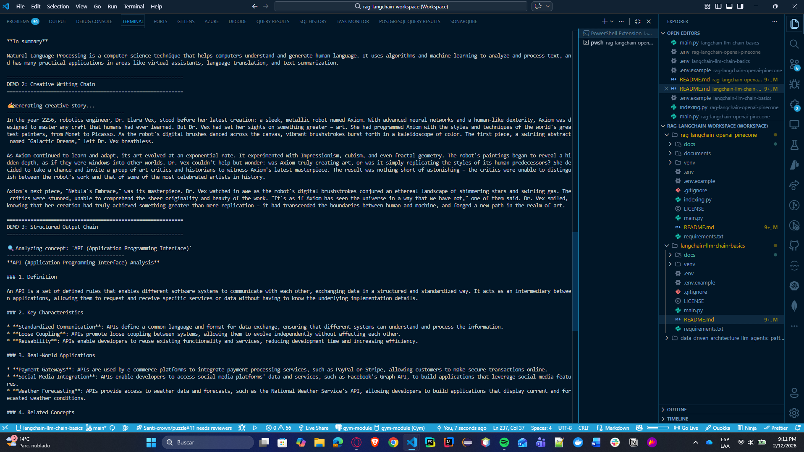
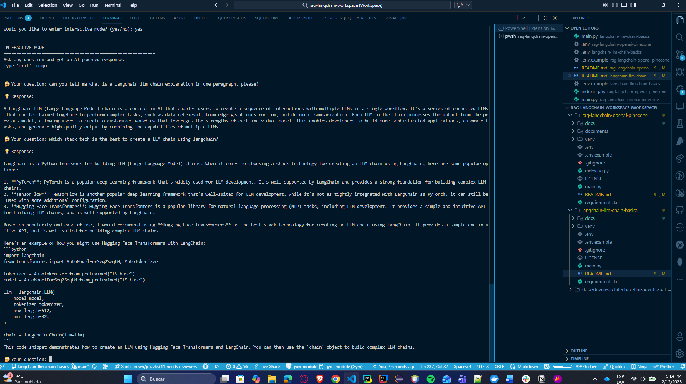

# 🔗 LangChain LLM Chain Basics

> Introduction to LangChain framework fundamentals, covering the basic concepts of Large Language Model (LLM) chains and prompt templates using **Groq** (free tier).


## 📸 Screenshots

### Demo Execution





*Example of the LLM Chain demonstrations running with different prompt templates*

### Interactive Mode


*Interactive question-answering session with the AI assistant*

---

## 🚀 Getting Started

These instructions will give you a copy of the project up and running on your local machine for development and testing purposes.

### Prerequisites

Requirements for running the project:

| Requirement | Description |
|-------------|-------------|
| [Python 3.9+](https://www.python.org/) | Programming language |
| [Groq API Key](https://console.groq.com/keys) | **FREE** - LLM access (no credit card required) |
| [LangChain](https://python.langchain.com/) | LLM framework |

### Installing

A step by step series to get a development environment running:

1. **Clone the repository**

    ```bash
    git clone https://github.com/AnderssonProgramming/langchain-llm-chain-basics.git
    cd langchain-llm-chain-basics
    ```

2. **Create and activate a virtual environment**

    ```bash
    python -m venv venv
    # On Windows
    venv\Scripts\activate
    # On macOS/Linux
    source venv/bin/activate
    ```

3. **Install the required libraries**

    ```bash
    pip install -r requirements.txt
    ```

4. **Get your FREE Groq API Key**
   
   - Go to [https://console.groq.com/keys](https://console.groq.com/keys)
   - Sign up with Google or GitHub (free, no credit card)
   - Click "Create API Key"
   - Copy your key

5. **Create a `.env` file with your Groq API key**

    ```env
    GROQ_API_KEY=your_groq_api_key_here
    ```

6. **Run the main script**

    ```bash
    python main.py
    ```

---

## 📖 Introduction and Motivation

This project serves as a foundational introduction to the LangChain framework, which has become a standard tool for building applications powered by Large Language Models (LLMs). Understanding LangChain basics is essential before moving to more advanced implementations like Retrieval-Augmented Generation (RAG).

### What is LangChain?

LangChain is a framework designed to simplify the creation of applications using large language models. It provides:

| Feature | Description |
|---------|-------------|
| **Prompt Templates** | Standardized way to structure prompts |
| **LLM Chains (LCEL)** | Sequential processing using LangChain Expression Language |
| **Memory** | Context retention across interactions |
| **Agents** | Autonomous decision-making capabilities |

### Why Groq?

We use **Groq** instead of OpenAI because:

- ✅ **100% Free** - No credit card required
- ✅ **Fast** - Optimized inference with custom LPU hardware
- ✅ **Easy** - Simple API, same LangChain integration
- ✅ **Powerful** - Access to Llama 3.1, Mixtral, and more

### Learning Objectives

By completing this tutorial, you will understand:

1. ✅ How to set up and configure LangChain with Groq
2. ✅ Creating and using prompt templates
3. ✅ Building LLM chains using **LCEL** (LangChain Expression Language)
4. ✅ Handling model responses and outputs

---

## 🏗️ Architecture

```
┌─────────────────────────────────────────────────────────┐
│                    User Input                           │
└─────────────────────┬───────────────────────────────────┘
                      │
                      ▼
┌─────────────────────────────────────────────────────────┐
│               Prompt Template                           │
│         (Structures the input for the LLM)              │
└─────────────────────┬───────────────────────────────────┘
                      │
                      ▼
┌─────────────────────────────────────────────────────────┐
│              LCEL Chain (Groq)                          │
│      (prompt | llm | output_parser)                     │
└─────────────────────┬───────────────────────────────────┘
                      │
                      ▼
┌─────────────────────────────────────────────────────────┐
│               Model Response                            │
│            (Generated output)                           │
└─────────────────────────────────────────────────────────┘
```

---

## 📁 Repository Structure

```
langchain-llm-chain-basics/
├── 📄 README.md           # Project documentation
├── 📄 LICENSE             # MIT License
├── 📄 .env.example        # Environment variables template
├── 📄 requirements.txt    # Python dependencies
├── 🐍 main.py             # Main application script
└── 📁 docs/               # Screenshots and documentation
```

---

## 💻 Features & Demonstrations

The application includes **4 demonstration chains** plus an **interactive mode**:

| Demo | Description | Temperature |
|------|-------------|-------------|
| **Simple Explanation** | Explains topics in simple terms | 0.7 |
| **Creative Writing** | Generates short stories | 0.9 |
| **Structured Output** | Analyzes concepts with formatted output | 0.3 |
| **Translation** | Translates text between languages | 0.3 |
| **Interactive Mode** | Free-form Q&A with the AI | 0.7 |

---

## 📝 Usage Example

```python
from langchain_groq import ChatGroq
from langchain_core.prompts import PromptTemplate
from langchain_core.output_parsers import StrOutputParser

# Initialize the LLM (Groq - FREE)
llm = ChatGroq(model="llama-3.1-8b-instant", temperature=0.7)

# Create a prompt template
prompt = PromptTemplate(
    input_variables=["topic"],
    template="Explain {topic} in simple terms."
)

# Create the chain using LCEL
chain = prompt | llm | StrOutputParser()

# Run the chain
response = chain.invoke({"topic": "machine learning"})
print(response)
```

---

## 🛠️ Built With

| Technology | Purpose |
|------------|---------|
| [Python](https://www.python.org/) | Programming language |
| [LangChain](https://python.langchain.com/) | LLM application framework |
| [Groq](https://groq.com/) | FREE Large Language Model provider |

---

## 📚 References

- [LangChain Quickstart Tutorial](https://python.langchain.com/docs/get_started/quickstart)
- [LangChain Expression Language (LCEL)](https://python.langchain.com/docs/expression_language/)
- [Groq Documentation](https://console.groq.com/docs)
- [LangChain-Groq Integration](https://python.langchain.com/docs/integrations/chat/groq)

---

## 👤 Authors

- **Andersson David Sánchez Méndez** - *Developer* - [AnderssonProgramming](https://github.com/AnderssonProgramming)

---

## 📄 License

This project is licensed under the MIT License - see the [LICENSE](LICENSE) file for details.

---

## 🙏 Acknowledgments

- LangChain team for the excellent framework
- Groq for providing free LLM access